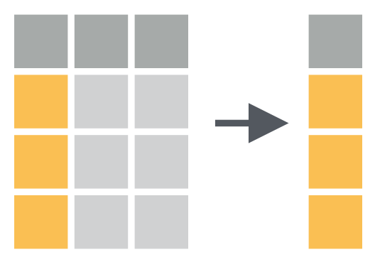
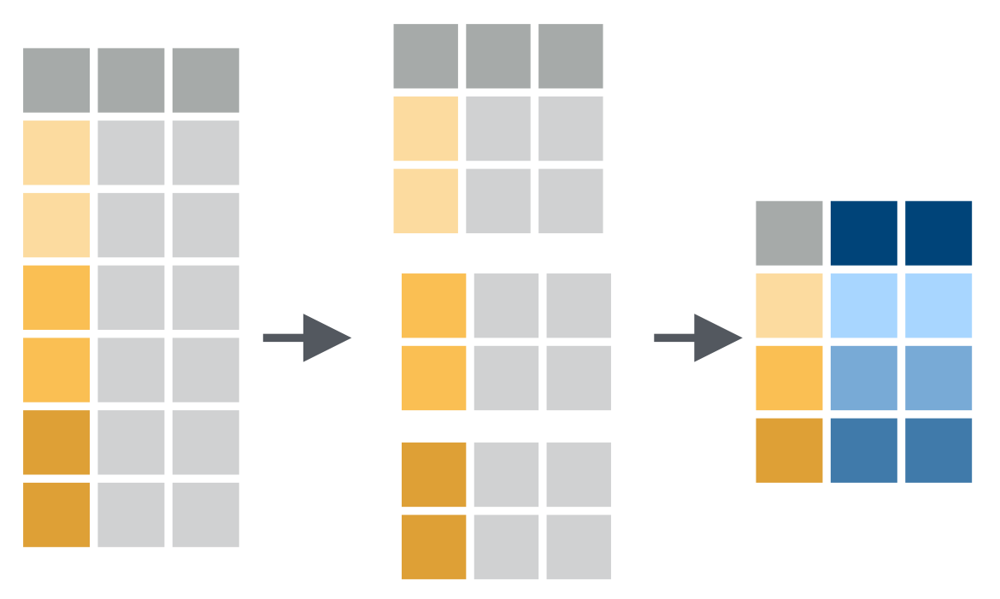

```{r setup, include=FALSE}
options(htmltools.dir.version = FALSE)
library(knitr)
```

<style type="text/css">
.remark-slide-content {
    font-size: 26px;
}
</style>

# Learning Objectives

By the end of this session, you should be able to:
- Use the **tidyverse** package to build your first data pipeline
- Perform basic data manipulation tasks
- Inspect and summarise data

---

class: center, middle

```{r, echo=FALSE, out.width = "50%"}

```

---

# The Tidyverse

- The tidyverse is a set of packages that work in harmony
- They share a common design ethos
- easy to install: `install.packages("tidyverse")`
- easy to load: `library(tidyverse)`

---

# The Tidyverse `r emo::ji("package")`

Running `library(tidyverse)` will load the following packages:
- `readr` > data import.
- `dplyr` > data manipulation.
- `tidyr` > data tidying.
- `ggplot2` > for data visualisation.*
- `purrr` > for functional programming.*
- `tibble` > for tibbles, a modern re-imagining of data frames.
- `stringr` > for strings.
- `forcats` > for factors.

We are going to give an overview of the first four packages. The others you will encounter as you develop your skills.

---

# The Missing Package

There is no package in the tidyverse for dealing with dates and times. This is the `lubridate` package.

For various reasons, `lubridate` is not included in `tidyverse`, but it is written by the same developers and follows the same principles.

---

class: inverse, center, middle

# Load the tidyverse

---

```{r}
library(tidyverse)
library(lubridate)
```

---

# Import the Course Data

We have already included data in your RStudio Cloud instance.
To import this into R, we simply need to run a function and that read the csv files: `read_csv()`.

```{r}
df <- read_csv("./data/synthetic_data_clean.csv")
```

---

# Inspect the Data

- Most hard work already done.
- Tables are nearly in a "tidy" format.
- Tidy data means:
  - Each column is a variable.
  - Each row is an observation.

---

```{r}
df
```

---

Another very powerful way to view the data is to use the `glimpse` function

--

```{r}
glimpse(df)
```

---

# Basic tasks: filter & select

First, let's _filter_ the demographic data by row

```{r}
filter(df, height >= 1.8)
```

---

This _filters_ rows from the `df` data frame where `height` is greater than or equal to `1.8`m.

---

# Notes on comparisons

- Equality:
  - `x == y` : is x equal to y?
  - `x != y` : is x not equal to y?
- Inequality:
  - `x >= y` : is x greater than or equal to y?
  - `x > y` : is x greater than y?
  - `x <= y` : is x less than or equal to y?
  - `x < y` : is x less than y?
- Membership:
  - `x %in% y` : is x contained within y?

---

This _filters_ rows from the `df` data frame where `height` is greater than or equal to `1.8`m.

Filter **always** acts on rows.
Will throw away any data that doesn't meet your request.

---

class: center, middle

```{r, echo = FALSE, out.width = "80%"}
include_graphics("./images/filter.png")
```

---

A similar function called `select` acts over columns. Just want the `sex` colum?

```{r}
select(df, sex)
```

---

class: center, middle

```{r, echo = FALSE, out.width = "80%"}

```

---

class: inverse, center, middle

# The Pipe

---

class: center, middle

```{r, echo = FALSE, out.width = "100%"}
include_graphics("./images/pipe.jpeg")
```

---

# The Pipe

Now here comes the _proper_ magic. What if you want to both filter and select?

```{r}
df %>%
  filter(height >= 1.8) %>%
  select(sex)
```

---

# %>%

- The `%>%` operator is called a **pipe**.
- It **pipes** data from one function to the next.
- This creates a data pipeline


- **Always** start with your data at the start of the pipeline

```r
my_data %>%
  do_this_function() %>%
  then_this_function() %>%
  and_then_this_function()
```

---

# Saving the pipeline

If we want to save the output of the pipe
Use the assignment operator at the start.
Otherwise the end of the pipeline will spit out into the console, but none of the actions will be saved

.pull-left[
```
my_data <- data %>%
  do_this() %>%
  then_this() %>%
  and_this()
```
This gets saved, but doens't print anything
]

.pull-right[
```
my_data %>%
  do_this() %>%
  then_this() %>%
  and_this()
```
This gets printed to the screen, but doesn't save anything
]

The benefit: each line is a **clear instruction** and is **readable**.

---

# Other useful tasks

- Count data by group membership.
- How many men and women are above or below 1.75 m height?

.pull-left[
```{r}
df %>%
  filter(height >= 1.75) %>%
  select(sex) %>%
  group_by(sex) %>%
  tally()
```
]

--

.pull-right[
```{r}
df %>%
  filter(height < 1.75) %>%
  select(sex) %>%
  group_by(sex) %>%
  tally()
```
]
---

# Verbs (*functions*) to remember

1. `arrange` - orders data using a named column
1. `group_by` - sets a column to be a grouping variable
1. `summarise` - summarises data over a grouping variable
1. `mutate` - add a new column to the data

Armed with only these 6 functions (remember filter and select), you can accomplish a huge amount that would be tiresome and frustrating in excel.

---

.pull-left[
```{r}
df %>%
  select(height, weight, sex) %>%
  arrange(height)
```
]

--

.pull-right[
```{r}
df %>%
  select(height, weight, sex) %>%
  arrange(desc(height))
```
]

---

class: middle, center

```{r, echo = FALSE, out.width = "80%"}
include_graphics("./images/arrange.png")
```

---

# Exercise (5 mins) `r emo::ji("stopwatch")`

- Use select, filter, group_by and arrange to:
  - Find the highest CRP for men and women
  - Find the highest apache for survivors and non-survivors

---

# Extending Groups with Summaries

```{r, eval = FALSE}
df %>%
  group_by(sex)
```

- On it's own, `group_by()` doesn't really accomplish anything particularly useful.
- The utility is apparant when we combine with a summary function (like we did with `tally()`)

---

```{r}
df %>%
  group_by(sex) %>%
  summarise(average_height = mean(height))
```

---

class: middle, center

```{r, echo = FALSE, out.width = "100%"}

```

---

class: middle, center

```{r, echo = FALSE, out.width = "100%"}
include_graphics("./images/summarise.png")
```

---

# Creating new variables

```{r}
df %>%
  mutate(bmi = weight / height^2) %>%
  select(weight, height, bmi)
```

---

class: center, middle

```{r, echo = FALSE, out.width = "100%"}
include_graphics("./images/mutate.png")
```

---

```{r}
df %>%
  mutate(bmi = weight / height^2) %>%
  select(weight, height, bmi, sex, vital_status) %>%
  arrange(desc(bmi))
```

---

# Exercise (5 mins) `r emo::ji("stopwatch")`

- Use the functions you have just learnt to:
  - Find the mean apache score for survivors and non-survivors (hint, use `mean()`)
  - Create a new column with the highest temp from temp_c and temp_nc (hint, use `max()`)
  
```r
select()
filter()
group_by()
arrange()
summarise()
mutate()
```

---

# Data Cleaning

- Steve has already shown us how to clean up out data in a spread sheet.
- Can we automate some of these tasks within `R`?

```{r}
df %>%
  names() %>%
  sort()
```

---

# Renaming variables

Some of these variable names are too vague for my liking.
- **chemo**: active or historical?
- **na**: too similar to the R concept of "missing" i.e. NA
- **system**: a little ambiguous

```r
df <- df %>%
  rename(new_name = old_name)
```

--

```{r}
df <- df %>%
  rename(chemo_6_months = chemo,
         sodium = na,
         organ_system = system)
```

---

# Wrangling strings

## Extracting Numbers

```{r}
df %>%
  select(creatinine) %>%
  head()
```

---

```{r}
df <- df %>%
  mutate(creatinine = parse_number(creatinine))

df %>%
  select(creatinine) %>%
  head()
```

---

# Parsing dates

```{r}
df <- df %>%
  mutate(los = interval(arrival_dttm, discharge_dttm) / days(1))

df %>%
  select(los)
```

---

## Pivoting Data

```{r}
df_long <- df %>%
  pivot_longer(
    cols = c("lactate_1hr", "lactate_6hr", "lactate_12hr"),
    names_to = "lactate_time",
    values_to = "lactate_value") %>%
  select(id, lactate_time, lactate_value)

head(df_long)
```

---

class: middle, center

```{r, echo = FALSE, fig.width=25, fig.height = 15}
df_long <- df %>%
    mutate(group = sample(1:10, size = nrow(df), replace = TRUE)) %>%
  pivot_longer(
    cols = c("lactate_1hr", "lactate_6hr", "lactate_12hr"),
    names_to = "lactate_time",
    values_to = "lactate_value") %>%
  select(id, group, lactate_time, lactate_value)

df_long <- df_long %>%
  filter(id %in% sample(df_long$id, 100, replace = FALSE))

df_long %>%
  mutate(lactate_time = factor(
    lactate_time,
    levels = c("lactate_1hr", "lactate_6hr", "lactate_12hr"),
    ordered = TRUE)) %>%
  ggplot(aes(group = id, x = lactate_time, y = lactate_value)) +
  geom_line(aes(colour = factor(group)), alpha = 0.5, size = 1.5) +
  theme_classic(base_size = 32) +
  scale_colour_discrete(guide = FALSE) +
  ylab("Lactate mmol/L") +
  xlab("Time Lactate Measured") +
  ggtitle("Serial Lactate Measurements")
```

---

# Exercise (5 mins) `r emo::ji("stopwatch")`

Use the functions you have just learnt to:
- Find the mean los for survivors and non-survivors in hours
- Calculate the age on arrival for these patients

.pull-left[
Core Functions
```r
select()
filter()
group_by()
arrange()
summarise()
mutate()
```
]

.pull-right[
Hints
```r
mean()
interval()
hours()
years()
mean()
```
]
