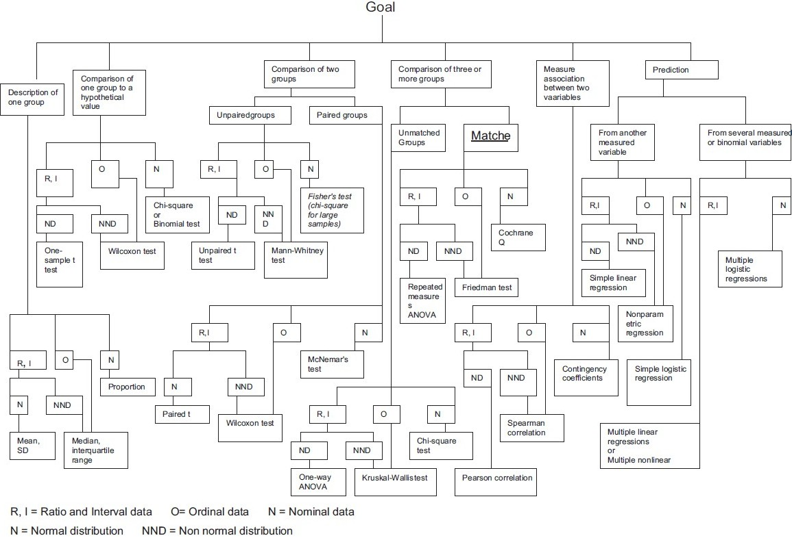
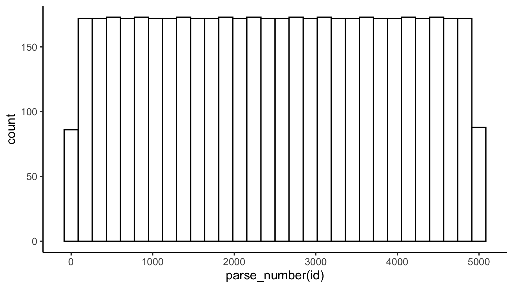

<style type="text/css">
.remark-slide-content {
    font-size: 26px;
}
</style>

```{r, include = FALSE}
library(tidyverse)
library(lubridate)
library(knitr)
df <- read_csv("../../../_episodes_rmd/data/synthetic_data_clean.csv")
```

## What we will cover

- Descriptive Statistics - Describing your data
- Pitfalls of Inference - Power, P values and Confidence Intervals


- Focus on visual intuitions
- (Almost) no maths

---

## Learning Objectives

By the end of the session you should be able to:

- Describe your data more effectively.
- Use basic statistics terminology correctly.
- Understand statistical power, p values and confidence intervals.
- Know where to go next for help.


Please *bear with me* if this feels simplistic.

---

class: inverse, center, middle

# What is statistics?


---

# What is statistics?

Statistics is the discipline that concerns the *collection*, *organization*, *displaying*, *analysis*, *interpretation* and *presentation* of data

Statistics is the science of learning from data

--

**Statistics != Hypothesis Testing**

---

class: inverse, center, middle

# What is data science?

---

background-color: #586376

```{r, echo=FALSE, out.width = "100%"}
knitr::include_graphics("images/venn_data_science.jpeg")
```

---

## The Big Picture

- Draw a sample from a population
- Inspecting it, organising it, summarising it: **Descriptive statistics**
- Draw conclusions about the population: **Inferential statistics**

---

class: center, bottom

```{r, echo=FALSE, out.width = "70%"}

```

## How not to do statistics... `r emo::ji("sad")`

---

# Descriptive Statistics

- How to describe the values a variable can take
- Summarising a **distribution** into a few numbers

# Measure types

- Binary: yes/no e.g. is the patient alive or dead
- Count: naturally bound at zero e.g. daily A&E admissions
- Continuous: e.g. Age, height, weight
- Discrete
  - Nominal: e.g. eye colour
  - Ordinal: e.g. likert approval scale

---

class: inverse, center, middle

# Describing Your Data

## Sodium

---

```{r, echo=FALSE, out.width = "100%"}
knitr::include_graphics("images/sodium_hist.png")
```

---

class: center, middle

# Is this normally distributed?

## If so, how should we describe this?

---

```{r, echo=FALSE, out.width = "100%"}
knitr::include_graphics("images/sodium_hist_norm.png")
```

---

# Exercise (5 mins)

- Have a look at potassium and id
- What are the shapes of these variables?
- How should we describe them?

---

```{r, echo=FALSE, out.width = "100%"}
knitr::include_graphics("images/k_hist.png")
```

---

```{r, echo=FALSE, out.width = "100%"}

```

---

class: middle, center

# Location & Spread

```{r, echo=FALSE, out.width = "70%"}
knitr::include_graphics("https://upload.wikimedia.org/wikipedia/commons/thumb/7/74/Normal_Distribution_PDF.svg/2000px-Normal_Distribution_PDF.svg.png")
```

---

class: middle, center

```{r, echo=FALSE, out.width = "80%"}
knitr::include_graphics("https://upload.wikimedia.org/wikipedia/commons/thumb/d/de/Comparison_mean_median_mode.svg/2000px-Comparison_mean_median_mode.svg.png")
```

---

# Exercise (5 mins)

- Try plotting histograms and calculate the mean and median for:
  - `wbc`,
  - `crp`,
  - `platelets`,
  - `hb`
- Are the mean and median good at describing these distributions
You can use the following functions: `mean()` and `median()`

---

# Descriptive stats made easy!

```{r}
df %>%
  select(wbc, crp, platelets, hb) %>%
  summary()
```

---

- Normally distributed
  - Mean and Standard deviation will *fully* define the shape
- Non normally distributed
  - Location might be better represented by median/mode
  - Spread might be better represented by lower/upper quartiles

.pull-left[
```{r, echo = FALSE}
tibble(x = seq(-4, 4, by = 0.01)) %>%
  ggplot(aes(x)) + 
  stat_function(
    fun = dnorm, args = list(mean = 0, sd = 1)) +
  xlim(c(-4, 4)) +
  theme_classic(base_size = 24) +
  ylab("density") +
  geom_vline(xintercept = 0, linetype = 2, colour = "red")
```
]

.pull-right[
```{r, echo = FALSE}
tibble(x = seq(0, 4, by = 0.001)) %>%
  ggplot(aes(x)) + 
  stat_function(
    fun = dlnorm, args = list(meanlog = 0, sdlog = 1)) +
  xlim(c(0, 4)) +
  theme_classic(base_size = 24) +
  ylab("density") +
  geom_vline(xintercept = 1.64, linetype = 2, colour = "red") +
  geom_vline(xintercept = 1, linetype = 2, colour = "blue")
```
]

---

class: middle, center

```{r, echo = FALSE, out.width="80%"}
knitr::include_graphics("./images/anscombes_quartet.png")
```

---

## Inferential Statistics

The following core concepts are central to inferential statistics, and often misunderstood:
- Power
- P values
- Confidence intervals.

**All** of these are *frequency* statistics. They have long running properties that are guaranteed.

---

class: middle, center, inverse

# Time to simulate

---

# Simulation

- 8 men with height 1.75 m -> `r rep(emo::ji("man_office_worker"), 8)`
- 8 women with average height 1.6 m -> `r rep(emo::ji("woman_office_worker"), 8)`

Normally we can't possibly know the population parameters.
With simulation we can fix these

```{r}
p_values <- c()

for (i in 1:1000) {
    men <- rnorm(8, 1.75, sd = 0.1)
  women <- rnorm(8, 1.60, sd = 0.1)
  
  t <- t.test(x = men, y = women, paired = FALSE, var.equal = TRUE)
  p_values <- c(p_values, t[["p.value"]])
}

sim <- tibble(
  trial_number = 1:1000,
  p_value = p_values)
```

---

class: middle, center

```{r, echo = FALSE, fig.width=20, fig.height=10}
tibble(men, women) %>%
  pivot_longer(cols = c(men, women),
               names_to = "sex", values_to = "height") %>%
  ggplot(aes(x = height, fill = sex)) + geom_histogram(binwidth = 0.1) +
  facet_grid(cols = vars(sex)) +
  theme_classic(base_size = 24) +
  theme(
    strip.background = element_rect(colour = "white", fill = "white"))
```

---

class: middle, center, inverse

# Power

---

# If you said...

- 1-power is the probability of a false negative for this study
- If the study P value > 0.05 at 80% power, the chance you are in error (the chance that your finding is a false negative) is 20%

# ... all wrong!

---

.pull-left[
```{r, echo=FALSE}
p_values <- c()

for (i in 1:1000) {
men <- rnorm(8, 1.75, sd = 0.1)
women <- rnorm(8, 1.60, sd = 0.1)
p_values <- c(p_values, t.test(x = men, y = women, paired = FALSE, var.equal = TRUE)$p.value)
}

sim <- tibble(
    trial_number = 1:1000,
    p_value = p_values)

head(sim, 20)
```
]

--

.pull-right[
```{r}
sim %>%
  group_by(
    signficant = p_value <= 0.05) %>%
  tally()
```
]

---

class: middle, center

## The power of a test (often written as a percentage) is the **pre-test probability** that the test will reject the test hypothesis at a pre-specified significance level. This significance level is usually (and arbitrarily) set to 0.05.

---

class: middle, center

## In plain English. If I were to repeat a study 1000 times, and I have 80% power at the 0.05 significance level, *and* a true effect exists. I would expect around 800 of the experiments to have a p value <= 0.05, and around 200 of the experiments to have a p value > 0.05

---

class: middle, center

# What is the probability of a true positive for *this* experiment?

---

class: middle, center

# How can we increase the power of a study?

---

```{r, out.width = "100%", echo = FALSE}
include_graphics("./images/power1.png")
```

---

```{r, out.width = "100%", echo = FALSE}
include_graphics("./images/power_curve.png")
```

---

# Traps to avoid

- The power is **not** a direct probability.
- It is *not* the probability that a specific experiment performed is a true positive
- The probability that any specific experiment is a true positive is either 1 or 0, we just don't know which.

---

# Statistical significance

- Statistical significance is a messy topic.
- Imagine two independent studies trying to investigate the same issue (for example, early antibiotics in sepsis):
  - Both powered at 80%.
  - Assume early antibiotics are beneficial
- Then the probability that both studies will have a p value <= 0.05:
  - $0.8 \times 0.8 = 0.64$
- The probability that one will be "positive" and the other be "negative" is:
  - $2 \times 0.8 \times 0.2 = 0.32$
- Perhaps we should not be so quick to point out where studies disagree, since this is somewhat expected behaviour?

---

class: center, middle, inverse

# P Values

---

# If you said...

The p value:
- is the probability that the test hypothesis is true
- is the probability that the result occurred due to chance
- if large is evidence in favour of the test hypothesis
- if larger than 0.05 means that there is no difference

# ... all wrong!

---

# New Simulation

New simulation. Now sampling from men and men (i.e. the same)

- 8 men with height 1.75 m -> `r rep(emo::ji("man_office_worker"), 8)`
- 8 men with height 1.75 m -> `r rep(emo::ji("man_office_worker"), 8)`

```{r, echo = FALSE}
p_values <- c()

for (i in 1:1000) {
men_a <- rnorm(8, 1.75, sd = 0.1)
men_b <- rnorm(8, 1.75, sd = 0.1)
p_values <- c(p_values, t.test(x = men_a, y = men_b, paired = FALSE, var.equal = TRUE)$p.value)
}

sim <- tibble(
    trial_number = 1:1000,
    p_value = p_values)
```

--

.pull-left[
```{r, echo = FALSE}
sim %>%
    group_by(signficant = p_value <= 0.05) %>%
    tally()
```
]

--

.pull-right[
```{r, echo = FALSE, warning = FALSE, fig.height=5}
sim %>%
  mutate(signficant = p_value <= 0.05) %>%
  ggplot(aes(x = signficant)) + geom_histogram(stat = "count") +
  theme_classic(base_size = 24)
```
]
---

class: center, middle

# The p value is the probability of seeing data this or more extreme, given that all your assumptions are true, and that *the null hypothesis is also true*. The p value is another hypothetical frequency probability. It is another long running measure.

---

# Traps to avoid

- A large p value does not mean *no difference*.
- A large p value just means that you couldn't detect a difference.
- It simply means that the data is compatible with your model (which includes the assumption that the null hypothesis is correct)

# Practical Advice

- A very small p value < 0.05 generally is in support of rejecting the null hypothesis (provided it isn't small because assumptions were violated)
- A small p value 0.05 - 0.2 is unclear, and should prompt to collect more data

---

class: center, middle, inverse

# Confidence Intervals

---

# If you said...

- The study confidence interval has a 95% probability of containing the true effect
- An effect size outside the 95% confidence interval has been rejected
- If two confidence intervals overlap, the difference between two estimates is not significant.

# ... all wrong!

---

# Confidence Intervals

Confidence intervals are another long running property of experiments. They are based upon the p value, and define a range of values that are compatible with the data.

Back to the original simulation (100 repeats this time):

- 8 men with height 1.75 m -> `r rep(emo::ji("man_office_worker"), 8)`
- 8 women with average height 1.6 m -> `r rep(emo::ji("woman_office_worker"), 8)`

--

Let's plot out the confidence interval for each experiment

---

```{r, out.width = "100%", echo = FALSE}
include_graphics("./images/ci1.png")
```

---

```{r, out.width = "100%", echo = FALSE}
include_graphics("./images/ci2.png")
```

---

# Confidence (Compatibility) Intervals

- around 5% of our samples contain the true difference of 0.15 m.
- Note that for each individual experiment, the chance that the confidence interval contains the true difference is either 0 or 1.
- The midpoint of the confidence interval is no more likely than any other.


- The confidence interval shows us a range of values that are *compatible* with your sample.

---

# Where to go next?

## I need answers now!
- Discovering Statistics Using R / Field
- R for Data Science / Wickham

## I have a thirst for deeper knowledge...
- Introduction to Probability & STAT 110 / Blitzstein
- Biostatistics for Biomedical Research / Harrell

## I'm clearly a Bayesian...
- Statistical Rethinking / McElreath

---

# References

1. Greenland S, Senn SJ, Rothman KJ, Carlin JB, Poole C, Goodman SN, et al. Statistical tests, P values, confidence intervals, and power: a guide to misinterpretations. Eur J Epidemiol. 2016 Apr;31(4):337–50. 

2. Harrell F, Slaughter J. Biostatistics for Biomedical Research. 2018 
